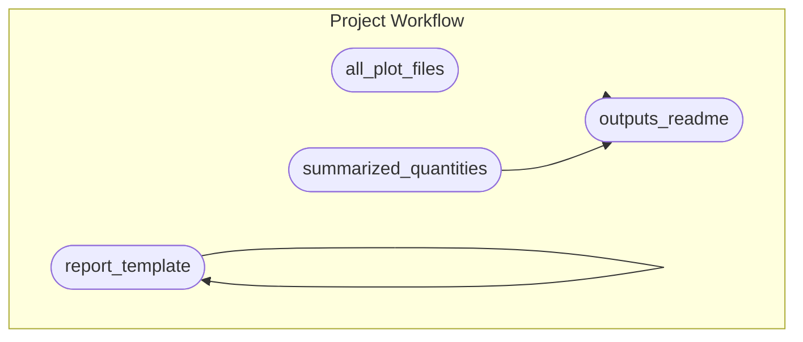

<!-- README.md is generated from README.Rmd. Please edit that file -->

# *mkrproj*

<!-- Standard badges and licenses: -->
<!--  Uncomment when deposited to Zenodo -->

[-MIT-green.svg)](https://opensource.org/licenses/MIT)
[-CC0_1.0-lightgrey.svg)](http://creativecommons.org/publicdomain/zero/1.0/)
[-CC_BY_4.0-blue.svg)](http://creativecommons.org/publicdomain/zero/1.0/)

<!-- If the repository is or will be related to a manuscript, keep the following
text. Otherwise replace it with a high-level summary and relevant citation,
contact, or re-use information. -->

This repository contains data and R code which are supplements to:

*Paper Title*, by Author
,
Author
,
and Author
,
(20XX)

Please cite that paper, when referring to this work. Please also cite
the permanent archive of repository (Zenodo reference
(<https://doi.org/%5BZENODO_DOI%5D>) when reusing or referring directly
to data and code.

## Repository Structure and Reproducibility

<!-- Modify this appropriate if you change project structure -->

- `data/` contains data from the study and a data dictionary describing
  all variables.
- `R/` contains functions used in this analysis.
- `reports/` contains R Markdown/Quarto reports generated in the
  analysis
- `outputs/` contains figures and other outputs
- This project uses the
  [{targets}](https://wlandau.github.io/targets-manual/) framework to
  organize build steps for analysis pipeline. The steps are defined in
  the `_targets.R` file and the workflow can be executed by running
  `run.R` via `source("run.R")` in your R terminal or `Rscript run.R` in
  your system shell. The schematic figure below summarizes the steps.
  (The figure is generated using `mermaid.js` syntax and should display
  as a graph on GitHub. It can also be viewed by pasting the code into
  <https://mermaid.live>.)

- This project was built with R version 4.2.2 (2022-10-31). This project
  uses the [{renv}](https://rstudio.github.io/renv/) framework to record
  R package dependencies and versions. Packages and versions used are
  recorded in `renv.lock` and code used to manage dependencies is in
  `renv/` and other files in the root project directory. On starting an
  R session in the working directory, run `renv::restore()` to install R
  package dependencies.

## Code of Conduct

Please note that this project is released with a [Contributor Code of
Conduct](https://contributor-covenant.org/version/2/1/CODE_OF_CONDUCT.html).
By contributing to this project, you agree to abide by its terms.
